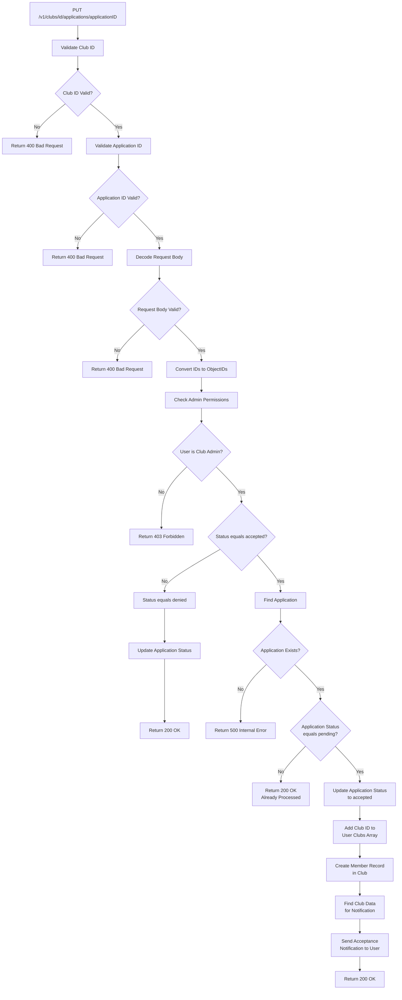

# Update Application

Accept or deny a membership application (admin only).

## Endpoint
`PUT /v1/clubs/{id}/applications/{applicationID}`

## Headers
- `Authorization: Bearer {firebase_token}`
- `UUID: {user_uuid}`

## Request Body
```json
{
  "status": "accepted|denied"
}
```

## Response
**200 OK**
```json
{
  "msg": "OK"
}
```

## Flow Diagram


## Implementation Details
- **Validation Phase:**
  - Validates club ID and application ID formats (must be 24+ characters)
  - Decodes and validates request body for status field
  - Checks admin permissions for the requesting user

- **For "denied" status:**
  - Simply updates application status in database
  - Returns success response

- **For "accepted" status (Complex Flow):**
  - Finds the application to verify it exists
  - Checks if application is still "pending" (prevents double-processing)
  - Updates application status to "accepted"
  - Adds club ID to user's clubs array in user collection
  - Creates new member record in club's members collection with "member" role
  - Fetches club data to get club name for notification
  - Sends push notification to applicant about acceptance
  - Returns success response

- **Duplicate Prevention:**
  - Only processes applications that are still in "pending" status
  - Already processed applications return OK without changes

## Error Responses
- `400 Bad Request` - Invalid club ID, application ID, or request body
- `403 Forbidden` - Only club admins can update applications
- `404 Not Found` - Application not found
- `500 Internal Server Error` - Database operations failed

## Related Files
- Implementation: `club/service/application.go:188` (`UpdateApplication()`)
- Helpers: `club/service/helpers.go:145` (`generateUpdateApplicationNotification()`)